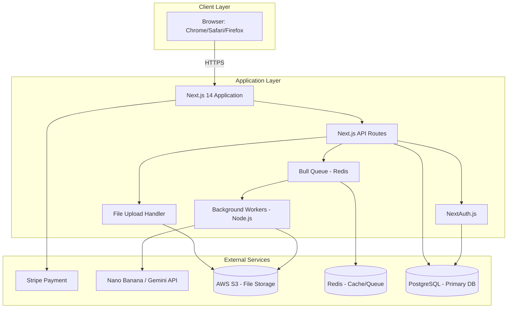
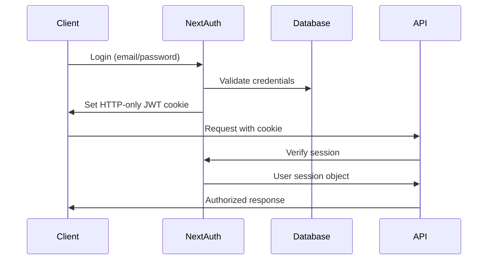

```
filename: architecture.md
---
title: System Architecture
owner: architect
version: 1.0
date: 2025-12-13
status: draft
approved_stack: nextjs_web_only
---

# System Architecture for Luminary Lab

## Approved Stack
This architecture implements the **nextjs_web_only** stack template as approved in stack-decision.md.

## 1. System Overview



**Data Flow:**
1. User authenticates via NextAuth.js (JWT sessions)
2. RAW file upload → S3 via signed URLs
3. Job creation → PostgreSQL + Bull Queue (Redis)
4. Background worker processes: RAW extraction → AI API → Blending → S3 storage
5. Real-time status updates via Server-Sent Events (SSE)
6. Export generates S3 pre-signed URLs for download

## 2. Technology Stack (nextjs_web_only)

| Layer | Technology | Version | Rationale | PRD Mapping |
|-------|------------|---------|-----------|-------------|
| **Stack Template** | **nextjs_web_only** | - | Approved stack: Next.js 14 + TypeScript | All |
| **Frontend Framework** | Next.js | 14.x | App Router, React Server Components, API Routes, optimal for full-stack web | NFR-COMPAT-001 |
| **Language** | TypeScript | 5.x | Type safety, better developer experience | All |
| **UI Framework** | Tailwind CSS | 3.x | Utility-first CSS for rapid development | - |
| **Component Library** | Headless UI/Radix UI | Latest | Accessible, unstyled components for custom design | NFR-ACCESS-001 |
| **State Management** | React Context + Zustand | Latest | Lightweight for client state, Context for auth | - |
| **API Client** | SWR/TanStack Query | Latest | Data fetching, caching, real-time updates | NFR-PERF-003 |
| **File Upload** | Uppy / Custom | Latest | Robust upload with progress, chunking | REQ-MEDIA-001 |
| **Authentication** | NextAuth.js | 5.x | JWT sessions, OAuth ready, secure by default | REQ-AUTH-001/002 |
| **ORM** | Prisma | 5.x | Type-safe database client, migrations | All |
| **Database** | PostgreSQL | 15.x | Reliable, scalable, ACID compliance | NFR-SCALE-001 |
| **Cache/Queue** | Redis (Upstash) | 7.x | Job queue, session store, rate limiting | NFR-SCALE-002 |
| **Job Queue** | Bull (BullMQ) | 4.x | Robust background job processing | REQ-MEDIA-004 |
| **Image Processing** | Sharp + RawPy (Python microservice) | Latest | High-performance RAW conversion and processing | REQ-MEDIA-001 |
| **AI Integration** | Custom SDK | - | Nano Banana/Gemini API clients with retry logic | REQ-INTEG-001 |
| **Payment** | Stripe | Latest | Subscription management, global payments | REQ-PAYMENT-001 |
| **Storage** | AWS S3 | - | Durable object storage for RAW/processed files | REQ-MEDIA-001 |
| **Deployment** | Vercel (App) + AWS (Workers) | - | Next.js optimized hosting + scalable background jobs | NFR-AVAIL-001 |
| **Monitoring** | Vercel Analytics + Sentry | Latest | Performance monitoring, error tracking | NFR-PERF-001/002 |

## 3. Component Design

### Core Application Components

| Component | Responsibility | PRD Requirements | Technology |
|-----------|---------------|------------------|------------|
| **Auth Service** | User registration/login, JWT session management | REQ-AUTH-001/002, NFR-SEC-002 | NextAuth.js |
| **File Upload Service** | RAW upload validation, S3 transfer, thumbnail generation | REQ-MEDIA-001, NFR-PERF-001 | Uppy, Sharp microservice |
| **Preset Manager** | Preset configuration, UI gallery, preview simulation | REQ-MEDIA-002, REQ-ADMIN-001 | Prisma, React Server Components |
| **Job Orchestrator** | Process job creation, queue management, status tracking | REQ-MEDIA-004, NFR-PERF-002 | Bull Queue, Redis |
| **AI Pipeline Worker** | RAW processing → AI API → Blending → Storage | REQ-INTEG-001, REQ-MEDIA-003 | Node.js, RawPy, AI SDK |
| **Export Service** | Format conversion (JPG/TIFF), color space management | REQ-MEDIA-006 | Sharp, S3 signed URLs |
| **Subscription Service** | Plan management, usage tracking, limit enforcement | REQ-PAYMENT-001/002 | Stripe, Prisma |
| **Project Gallery** | Project CRUD, thumbnail grid, search/filter | REQ-CRUD-001, REQ-MEDIA-007 | Next.js App Router, Prisma |

## 4. Frontend Architecture

### Next.js 14 App Structure
```
app/
├── (auth)/          # Auth routes group
│   ├── login/
│   ├── register/
│   └── layout.tsx
├── (dashboard)/     # Protected routes group
│   ├── layout.tsx   # Auth validation, sidebar
│   ├── page.tsx     # Project gallery
│   ├── projects/
│   ├── upload/
│   └── profile/
├── api/             # Next.js API routes
│   ├── auth/[...nextauth]/
│   ├── upload/
│   ├── jobs/
│   └── export/
├── components/      # Reusable components
│   ├── ui/          # Base UI (buttons, inputs)
│   ├── upload/      # File upload component
│   ├── editor/      # Preset/Intensity controls
│   └── gallery/     # Project grid
└── lib/             # Utilities, clients
```

### Key Design Decisions:
1. **React Server Components (RSC)** for initial page loads (SEO, performance)
2. **Client Components** only where needed (interactive: upload, sliders)
3. **API Routes** for backend operations (auth, file operations, jobs)
4. **Middleware** for authentication and rate limiting
5. **Server-Sent Events (SSE)** for real-time job status updates
6. **Optimistic UI** for instant feedback on user actions

## 5. Backend Architecture

### Next.js API Routes Pattern
```typescript
// Example: /api/jobs/[id]/status
export async function GET(
  req: NextRequest,
  { params }: { params: { id: string } }
) {
  const session = await getServerSession(authOptions);
  if (!session) return new Response('Unauthorized', { status: 401 });
  
  const job = await prisma.job.findUnique({
    where: { id: params.id, userId: session.user.id }
  });
  
  return NextResponse.json(job);
}
```

### Background Processing Architecture
1. **Job Creation**: API route validates → creates DB record → queues Bull job
2. **Worker Pool**: Auto-scaling Node.js workers process from Redis queue
3. **Processing Steps**:
   - Fetch RAW from S3
   - Convert to high-quality JPEG via Python microservice
   - Call AI API with preset-specific prompt
   - Blend result with original based on intensity
   - Store final image in S3
   - Update job status in DB
4. **Status Updates**: Workers emit events → Redis → SSE to client

### External Service Integration
| Service | Integration Pattern | Retry Strategy |
|---------|-------------------|----------------|
| **AI API** | HTTP client with exponential backoff | 3 retries, circuit breaker |
| **Stripe** | Webhooks for subscription events | Idempotency keys, event deduplication |
| **S3** | Pre-signed URLs for upload/download | Direct client upload to avoid server bandwidth |
| **RawPy Microservice** | HTTP/REST for RAW conversion | 2 retries, fallback to LibRaw |

## 6. Database Design

### PostgreSQL Schema Overview
```sql
-- Core Tables
users (
  id UUID PRIMARY KEY,
  email VARCHAR(255) UNIQUE NOT NULL,
  password_hash VARCHAR(255),
  display_name VARCHAR(100),
  subscription_tier VARCHAR(50),
  stripe_customer_id VARCHAR(255),
  monthly_quota INTEGER DEFAULT 5,
  monthly_used INTEGER DEFAULT 0,
  created_at TIMESTAMPTZ DEFAULT NOW()
);

projects (
  id UUID PRIMARY KEY,
  user_id UUID REFERENCES users(id) ON DELETE CASCADE,
  name VARCHAR(255),
  original_file_key VARCHAR(500),  -- S3 key
  processed_file_key VARCHAR(500), -- S3 key
  preset_id UUID REFERENCES presets(id),
  intensity DECIMAL(3,2) DEFAULT 1.0,
  status VARCHAR(50) DEFAULT 'pending',
  created_at TIMESTAMPTZ DEFAULT NOW(),
  INDEX idx_user_created (user_id, created_at DESC)
);

presets (
  id UUID PRIMARY KEY,
  name VARCHAR(100) NOT NULL,
  description TEXT,
  ai_prompt TEXT NOT NULL,
  blend_strength DECIMAL(3,2) DEFAULT 0.7,
  example_image_url VARCHAR(500),
  is_active BOOLEAN DEFAULT true,
  created_at TIMESTAMPTZ DEFAULT NOW()
);

job_queue (
  id UUID PRIMARY KEY,
  project_id UUID REFERENCES projects(id) ON DELETE CASCADE,
  status VARCHAR(50) DEFAULT 'queued',
  attempts INTEGER DEFAULT 0,
  error_message TEXT,
  started_at TIMESTAMPTZ,
  completed_at TIMESTAMPTZ,
  INDEX idx_status_created (status, created_at)
);

-- Audit Table
audit_logs (
  id UUID PRIMARY KEY,
  user_id UUID REFERENCES users(id),
  action VARCHAR(100),
  resource_type VARCHAR(50),
  resource_id UUID,
  metadata JSONB,
  created_at TIMESTAMPTZ DEFAULT NOW()
) INHERITS (timestamps);
```

### Index Strategy
1. **Composite Index** on `projects(user_id, created_at)` for gallery pagination
2. **Partial Index** on `job_queue(status)` where `status IN ('queued', 'processing')`
3. **Unique Constraint** on `users(stripe_customer_id)` for subscription mapping

## 7. Security Architecture

### Authentication Flow


### Security Measures
| Threat | Mitigation | PRD Mapping |
|--------|------------|-------------|
| **Credential Theft** | bcrypt (work factor 12), HTTPS only, HSTS | NFR-SEC-001, NFR-SEC-003 |
| **Session Hijacking** | JWT with 1hr expiry, HTTP-only cookies, CSRF tokens | NFR-SEC-002 |
| **Injection Attacks** | Prisma parameterized queries, input validation | NFR-SEC-004 |
| **File Upload Attacks** | Content-type validation, virus scan, S3 bucket policies | REQ-MEDIA-001 |
| **AI Prompt Injection** | Strict prompt templates, sanitization, rate limiting | REQ-INTEG-001 |
| **Data Exposure** | Row-level security via user_id checks, S3 pre-signed URLs | NFR-SEC-005 |

### Authorization Model
- **User Level**: Can only access own projects (enforced at API layer)
- **Admin Level**: Access to preset management via separate admin route
- **Resource Limits**: Enforced per user based on subscription tier

## 8. Performance & Scalability

### Caching Strategy
| Cache Layer | Technology | Purpose | TTL |
|------------|------------|---------|-----|
| **CDN** | Vercel Edge Network | Static assets, preset thumbnails | 1 hour |
| **Application** | Redis | Session store, rate limiting, job queue | Variable |
| **Database** | PostgreSQL connection pool | Connection reuse | Persistent |

### Scaling Approach
1. **Horizontal Scaling**:
   - Next.js app: Vercel auto-scales based on traffic
   - Background workers: Auto-scale based on Redis queue depth
   - Database: Read replicas for gallery queries, connection pooling

2. **Performance Optimizations**:
   - RAW thumbnail generation: 512px previews for UI
   - Progressive image loading for gallery
   - Lazy loading of editor components
   - Database connection pooling (PgBouncer)

3. **Monitoring**:
   - Vercel Analytics for Core Web Vitals
   - Custom metrics for job processing times (P90 < 120s)
   - Alerting on error rates, queue backlogs

### Cost Optimization
- **AI API**: Request batching potential for future batch processing
- **Storage**: S3 lifecycle policies (move to Glacier after 90 days)
- **Compute**: Spot instances for background workers
- **CDN**: Vercel includes 100GB bandwidth on Pro plan

## 9. Deployment Architecture

### Environment Strategy
| Environment | Purpose | Branch | URL Pattern |
|-------------|---------|--------|-------------|
| **Development** | Feature development | feature/* | `feature-*.vercel.app` |
| **Staging** | QA testing, UAT | develop | `staging.luminarylab.com` |
| **Production** | Live users | main | `app.luminarylab.com` |

### CI/CD Pipeline (GitHub Actions)
```yaml
name: Deploy
on:
  push:
    branches: [main, develop]
jobs:
  test:
    runs-on: ubuntu-latest
    steps:
      - run: npm test
      - run: npm run type-check
  deploy:
    needs: test
    runs-on: ubuntu-latest
    steps:
      - uses: vercel/action@v1
        with:
          vercel-token: ${{ secrets.VERCEL_TOKEN }}
          vercel-org-id: ${{ secrets.ORG_ID}}
          vercel-project-id: ${{ secrets.PROJECT_ID}}
```

### Infrastructure (AWS + Vercel)
```
Vercel (Frontend + API Routes)
├── Edge Network (Global CDN)
├── Serverless Functions (API Routes)
└── Automatic HTTPS, DDoS protection

AWS (Background Services)
├── EC2 (Background Workers - auto-scaling group)
├── RDS PostgreSQL (Primary database)
├── ElastiCache Redis (Queue + cache)
├── S3 (File storage with lifecycle policies)
└── CloudWatch (Monitoring + alerts)
```

### Disaster Recovery
1. **Database**: Daily automated backups with 30-day retention
2. **File Storage**: S3 versioning enabled, cross-region replication
3. **Deployment Rollback**: Vercel instant rollback to previous deployment
4. **Incident Response**: PagerDuty integration for critical alerts

---
*This architecture implements the approved nextjs_web_only stack template and addresses all MVP requirements from the PRD. The design prioritizes security, performance, and scalability while maintaining flexibility for future enhancements.*
```